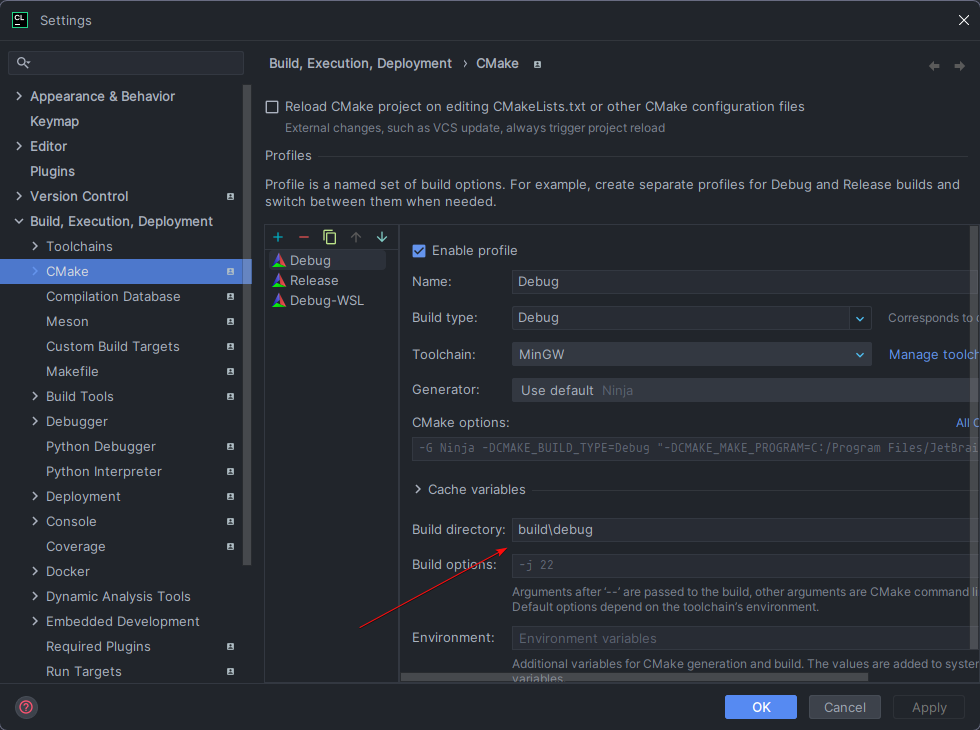

# Dependencies
- wxWidgets
- OpenCV

## Linux
```bash
sudo apt install libgtk-3-dev libwxgtk3.2-dev libopencv-dev
```

# Reloading translations
You may wish to reload translations while developing. To do so, either:
- Rerun CMake
- Replace `bin/text.csv` in the corresponding build directory with the updated file

# Recommended CLion CMake settings
Set your build directory inside `./build`, its ignored by git. 
